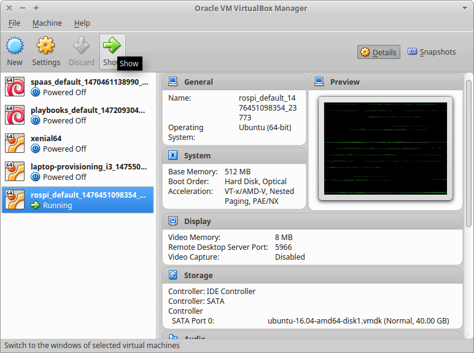

rospi
=====

Sets up Raspberry PI with ROS. Provisioned by [ansible](https://docs.ansible.com/).

Testing this on your computer
-----------------------------

You need to install the following software:

- [Vagrant](https://www.vagrantup.com/downloads.html)
- [VirtualBox](https://www.virtualbox.org/)
- git

Clone this repository:

    $ git clone https://github.com/shuhaowu/rospi.git
    $ cd rospi

Start the VM:

    $ vagrant up

Enter the VM:

    $ vagrant ssh

Switch to the robot user to test ROS applications:

    $ sudo su robot
    $ source /etc/profile.d/ros-activate.sh

Alternatively, start Virtualbox and "Show" the machine with the name starting
as "rospi_default":

Then login with the username and password of `robot` and `robot`.

Provision a Raspberry Pi
------------------------

1. Get the ubuntu minimal image for raspberry pi from here: http://ubuntu-pi-flavour-maker.org/.
2. Flash the image onto a raspberry pi.
3. On your control computer, ensure your `hosts` file has a `rospi` entry with
   the IP address of the Raspberry PI on the local network.
4. `ansible-playbook -i raspi3 raspi3.yml`
5. The username and password to use is `robot` and `robot` respectively.
